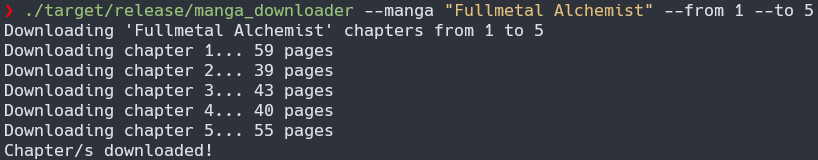
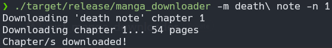

# Rust Manga Scrapper

## Description
This program allows you to scrap manga chapters from [leercapitulo.com](https://www.leercapitulo.com/) (spanish only :D) in a simple and automated way. It uses Selenium to control a Chrome browser and Reqwest to download chapter images.

## Requirements
- [Chromedriver](https://sites.google.com/chromium.org/driver/) installed and in the PATH.
- [Google Chrome](https://www.google.com/chrome/) installed and compatible with previous Chromedriver.
- [Rust](https://www.rust-lang.org/tools/install) installed (to compile).

## Installation
1. Clone this repository:
   ```
   git clone https://github.com/Hakaary/Rust-Manga-Scrapper.git
   ```
   
2. Build the binary:
   ```
   cd rust_manga_scrapper
   cargo build --release
   ```

3. Location:

   The binary will be located here:
   
   ```
   target/release/manga_downloader
   ```

## Usage

### Arguments

`--manga` of `-m`: The name of the manga you want to download.

`--from` or `-f`: The number of the first chapter to download.

`--to` or `-t`: The number of the last chapter to download.

`--number` or `-n`: Download only a specific chapter.


Run the program from the command line, providing the necessary arguments. For example, assuming the binary is this path:

```
./target/release/manga_downloader --manga "Fullmetal Alchemist" --from 1 --to 5
```



```
./target/release/manga_downloader -m death\ note -n 1
```



## Software development process

### First approach

The first approach was to make everything linear and sequential, easy. At first, the program just scrapped the images one by one, including the dowloand and save on memory task. The were no advantages of using Tokio, because any of its asynchronous functionalities were really being used.

### Current approach

After the program was already working, a minimal refactor of the code took all of those asynchronous tasks and allow to paralelize many tasks: downloand all pages of a chapter at once and save them on memory. With that done, the time per chapter lowered from almost a minute by chapter to less than 2 seconds.


